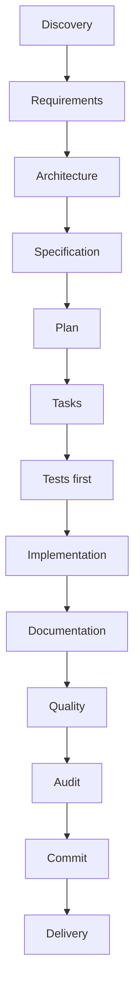

# SDD Master

<p align="center">
  
</p>

<p align="center">
  <strong>Framework rígido para desenvolvimento de software com especificação, TDD, documentação, auditoria, rastreabilidade, segurança e agentes de IA.</strong>
</p>


## O que é o SDD Master?

O SDD Master é um framework que guia a criação de software passo a passo.

Ele impede que uma IA ou desenvolvedor saia codando sem antes definir:

- o que será feito;
- por que será feito;
- quais testes validam;
- quais documentos precisam ser atualizados;
- quais riscos existem;
- o que pode ou não ir para o GitHub.

Em linguagem simples: o SDD Master coloca trilhos, freios e evidências no processo de desenvolvimento assistido por IA.

## Como funciona tecnicamente?

O SDD Master combina:

- CLI npm;
- estrutura `.sdd-master/`;
- documentação pública em `docs/`;
- templates oficiais;
- comandos de diagnóstico;
- arquivos de instrução para agentes;
- validações de segurança/Git;
- governança por fase;
- TDD obrigatório;
- auditoria e rastreabilidade.

## Instalação via npm

```bash
npm install -g sdd-master@prototype
sdd master help
```

O pacote está publicado como prototype e ainda não representa uma release estável. Use a dist-tag `prototype` para instalar esta versão.

```text
sdd-master@0.1.0-prototype.1
```

Como esta é a primeira versão publicada no npm, o registry mantém `latest` apontando para `0.1.0-prototype.1` e não permitiu remover essa dist-tag enquanto não há outra versão publicada. A instalação recomendada para este estágio continua sendo `sdd-master@prototype`.

Evite usar:

```bash
npm install -g sdd-master
```

até existir uma release estável.

## Uso local durante desenvolvimento

```bash
npm install
npm run build
node dist/cli/main.js master help
```

## Comandos atuais

| Comando | Status | O que faz |
|---|---|---|
| `sdd master help` | Disponível | Mostra ajuda |
| `sdd master init` | Disponível | Inicializa estrutura SDD Master |
| `sdd master doctor` | Disponível | Diagnostica instalação |
| `sdd master agents` | Disponível | Gera instruções multi-IA |
| `sdd master git` | Disponível | Valida Git e segurança |
| `sdd master skills` | Disponível | Gerencia skills locais e relatórios |
| `sdd master uiux` | Disponível | Cria gates de design e interface |
| `sdd master update` | Disponível | Atualiza instalação local com backup |
| `sdd master discovery` | Disponível | Cria discovery inicial |
| `sdd master requirements` | Disponível | Cria requisitos iniciais |
| `sdd master spec` | Disponível | Cria especificação inicial |
| `sdd master plan` | Disponível | Cria plano técnico inicial |
| `sdd master tasks` | Disponível | Cria tarefas iniciais |
| `sdd master update` | Planejado | Atualizará templates/estrutura |

## Fluxo visual




## Compatibilidade multi-IA


O SDD Master pode gerar arquivos de instrução para diferentes agentes de codificação:

- Codex: `AGENTS.md`
- Claude: `CLAUDE.md`
- Cursor: `.cursor/rules/sdd-master.mdc`
- Gemini: `GEMINI.md`
- Copilot: `.github/copilot-instructions.md`
- Windsurf, Cline, Roo, Aider, Continue e genéricos

Exemplo:

```bash
sdd master agents --yes --agents=codex,claude,cursor --language=pt-BR
```

Esses arquivos orientam cada IA a ler a constituição, respeitar o estado do projeto, não pular fases, não fazer push sem autorização humana e não expor `.env`, segredos, tokens ou credenciais.

## Segurança


Regras fortes do SDD Master:

- não commitar `.env`;
- não expor segredo;
- não fazer push sem autorização humana;
- não enviar `.sdd-master/` ao remoto do produto;
- testar antes de implementar;
- documentar e auditar antes de avançar.

Use:

```bash
sdd master git
sdd master git --pre-commit
sdd master git --pre-push
```

O comando verifica arquivos sensíveis, possíveis segredos, `.gitignore`, risco de envio de `.sdd-master/` e status básico do Git. O SDD Master nunca executa push automaticamente.

## Estrutura gerada no projeto consumidor

```text
.sdd-master/
  constitution.md
  project-state.md
  templates/
  audits/
  traceability/
  approvals/

docs/
  01-negocio-requisitos/
  02-tecnica-arquitetura/
  03-codigo/

.agents/
  skills/
```

## Exemplos de saída

```bash
sdd master doctor
```

```text
SDD Master — Doctor

Status geral:
  healthy

Próximo passo recomendado:
  /sdd-master-discovery
```

```bash
sdd master git --pre-push
```

```text
SDD Master — Git/Security Check

Status geral:
  clean

Decisão:
  Nenhum bloqueio crítico encontrado.
```

```bash
sdd master agents --yes --agents=codex,claude,cursor --language=pt-BR
```

```text
SDD Master — Agentes configurados

Agentes:
  codex, claude, cursor
```

## Templates oficiais

O SDD Master instala templates locais em `.sdd-master/templates/` para requisitos, produto, arquitetura, código, workflow, governança, segurança, UI/UX, operações e agentes/IA.

Templates são pontos de partida. Documentos reais devem ser criados a partir deles, revisados e aprovados pelo fluxo SDD Master.

## Workflow SDD inicial

Comandos iniciais:

```bash
sdd master discovery --yes --title="Meu Projeto" --project-type="web" --profiles="WEB" --maturity="M0"
sdd master requirements --yes --title="Requisitos iniciais"
sdd master spec --yes --phase="PHASE-01" --title="Especificação inicial"
sdd master plan --yes --phase="PHASE-01" --title="Plano técnico inicial"
sdd master tasks --yes --phase="PHASE-01" --title="Tarefas iniciais"
```

Esses comandos criam documentos locais em `.sdd-master/` e documentação pública em `docs/`. Cada etapa registra `Aprovação humana: Pendente` e preserva arquivos existentes por padrão.

## Governança antes da implementação

Antes de implementar, o SDD Master exige:

- dúvidas resolvidas;
- escopo controlado;
- backlog separado do escopo atual;
- aprovações humanas registradas;
- bloqueios formais verificados.

Comandos:

```bash
sdd master clarify --yes --title="Dúvida sobre escopo" --phase="PHASE-01"
sdd master approve --yes --target="tasks" --phase="PHASE-01" --decision="approved" --reason="Tarefas aprovadas."
sdd master scope --yes --type="change" --title="Nova solicitação" --phase="PHASE-01"
sdd master backlog --yes --type="improvement" --title="Melhoria futura" --priority="COULD"
```

## Quality, audit, docs e blockers

Antes de implementar, o SDD Master exige portões formais de qualidade, auditoria e documentação.

Comandos:

```bash
sdd master quality --yes --phase="PHASE-01" --target="tasks" --title="Revisão de qualidade"
sdd master audit --yes --phase="PHASE-01" --type="self-audit" --title="Auditoria da fase"
sdd master docs --yes --phase="PHASE-01" --target="workflow" --title="Validação documental"
sdd master blocker --yes --title="Bloqueio formal" --phase="PHASE-01" --severity="BLOCKER"
```

Blockers abertos impedem a futura implementação.

## Skills locais e UI/UX

O SDD Master trata design como diferencial do framework.

Comandos:

```bash
sdd master skills --yes --title="Skill de UI/UX" --category="uiux" --source="https://github.com/sickn33/antigravity-awesome-skills/"
sdd master skills --yes --skill="SKILL-001" --approve
sdd master skills --yes --skill="SKILL-001" --install-local
sdd master uiux --yes --phase="PHASE-01" --profile="WEB" --title="Revisão UI/UX inicial"
```

Regras:

- skills são locais;
- nada é instalado globalmente por padrão;
- skills externas exigem aprovação humana;
- toda skill usada aparece em relatório;
- UI/UX, acessibilidade, SEO e responsividade bloqueiam implementação quando aplicável.

## Update seguro

O comando `sdd master update` atualiza uma instalação local do SDD Master sem apagar histórico.

Exemplos:

```bash
sdd master update --dry-run
sdd master update --apply --yes
```

Regras:

- cria backup antes de aplicar mudanças;
- não sobrescreve documentos preenchidos sem segurança;
- preserva decisões humanas;
- registra relatório em `.sdd-master/reports/`;
- nunca cria `.env`;
- nunca apaga rastreabilidade.

## Implement Guard

O comando `sdd master implement` existe como guardião de implementação.

Nesta versão prototype, ele não altera código do projeto consumidor.

Ele verifica:

- requisitos;
- especificação;
- plano;
- tarefas;
- aprovações humanas;
- dúvidas abertas;
- escopo;
- qualidade;
- auditoria;
- documentação;
- blockers;
- UI/UX, design system, acessibilidade, SEO e responsividade quando aplicável;
- relatório de skills usadas;
- testes obrigatórios antes da implementação;
- segurança/Git.

Exemplo:

```bash
sdd master implement --yes --phase="PHASE-01" --task="TASK-001" --dry-run
```

## Qualidade e validação local

Antes de qualquer release ou publicação, execute:

```bash
npm run check
```

O check executa:

- build;
- testes;
- lint;
- formatação;
- smoke test do CLI;
- validação de pacote;
- dry-run do npm pack.

## Validação de pacote

```bash
npm run package:check
npm run pack:dry-run
```

Esses scripts verificam se o pacote contém os arquivos necessários para uso via CLI e se arquivos proibidos ficam fora do empacotamento npm.

## Release local prototype

A versão atual é:

```text
0.1.0-prototype.1
```

Esta versão consolida ajustes finais após a tag inicial `v0.1.0-prototype`, sem reescrever o histórico Git nem mover a tag já publicada.

Antes de qualquer publicação:

```bash
npm run check
npm run release:check
npm publish --dry-run --access public --tag prototype
```

Esta versão prototype usa a tag npm `prototype`, não `latest`. Use `--tag prototype` explicitamente em dry-runs e em qualquer publicação futura aprovada.

A publicação real no npm e o push para GitHub exigem aprovação humana explícita.

## GitHub Release

A primeira versão pública preparada é:

```text
v0.1.0-prototype.1
```

Status:

- Tag inicial `v0.1.0-prototype` preservada sem reescrita.
- Nova tag `v0.1.0-prototype.1` preparada para alinhar versão, documentação e release draft futura.
- GitHub Release final ainda não publicada.
- npm publish real executado para `sdd-master@0.1.0-prototype.1` com dist-tag `prototype`.
- npm `latest` também aponta para `0.1.0-prototype.1` por comportamento automático da primeira publicação.
- npm bloqueou a remoção de `latest` enquanto `0.1.0-prototype.1` é a única versão publicada.

A release atual é um prototype e não representa versão final estável.

## Publicação

O SDD Master possui:

- GitHub Release draft;
- publicação npm prototype;
- validação local com `npm publish --dry-run --access public --tag prototype`.

A publicação final da GitHub Release exige aprovação humana explícita.

## Contribuição e GitHub

Contribuições devem usar os templates de issue e Pull Request do repositório. Antes de enviar uma mudança para revisão, execute `npm run check` e registre os checks relevantes no Pull Request.

Nunca publique `.env`, tokens, credenciais, chaves privadas, certificados, dados pessoais, logs sensíveis ou conteúdo interno de `.sdd-master/` de projetos consumidores. Issues públicas devem descrever problemas sem expor valores ou arquivos privados.

## Documentação pública

- [Visão do produto](docs/01-negocio-requisitos/visao-do-produto.md)
- [Arquitetura do framework](docs/02-tecnica-arquitetura/arquitetura-do-framework.md)
- [Compatibilidade multi-IA](docs/02-tecnica-arquitetura/compatibilidade-multi-ia.md)
- [Segurança e governança](docs/02-tecnica-arquitetura/seguranca-e-governanca.md)
- [Comandos CLI](docs/03-codigo/comandos-cli.md)
- [Desenvolvimento local](docs/03-codigo/desenvolvimento-local.md)
- [Workflow SDD](docs/03-codigo/workflow-sdd.md)
- [Skills locais e UI/UX](docs/03-codigo/skills-uiux.md)
- [Update seguro](docs/03-codigo/update-seguro.md)

## Roadmap

- Fundação npm
- CLI base
- Init
- Templates
- Doctor
- Multi-IA
- Git/Security
- README premium
- Testes/qualidade
- GitHub público
- Release prototype
- npm package

## Licença

Distribuído sob a licença MIT. Consulte [LICENSE](LICENSE).
