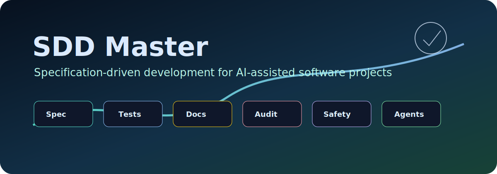
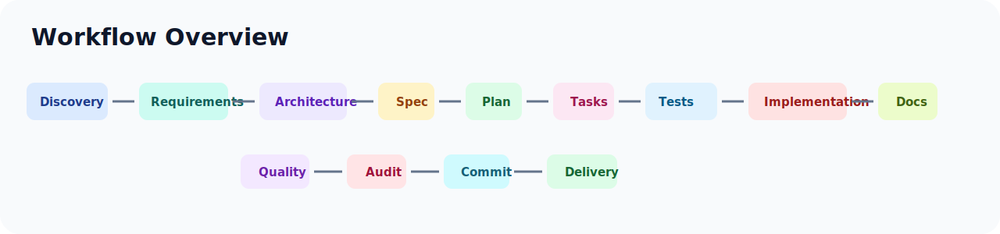
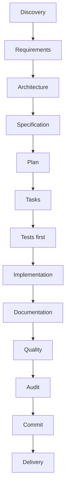
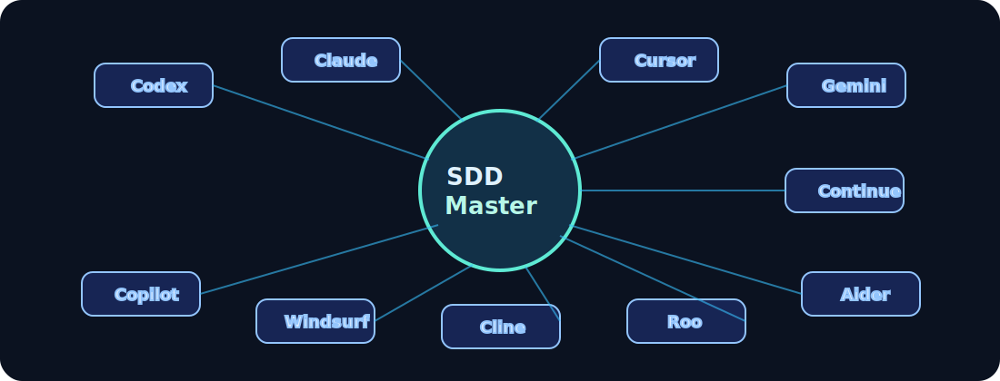
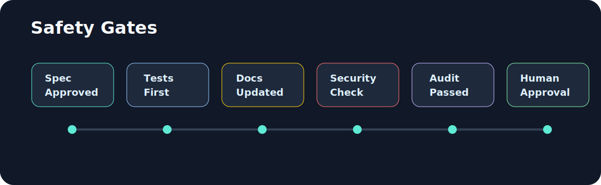

# SDD Master

<p align="center">
  
</p>

<p align="center">
  <strong>Framework rígido para desenvolvimento de software com especificação, TDD, documentação, auditoria, rastreabilidade, segurança e agentes de IA.</strong>
</p>


## O que é o SDD Master?

O SDD Master é um framework que guia a criação de software passo a passo.

Ele impede que uma IA ou desenvolvedor saia codando sem antes definir:

- o que será feito;
- por que será feito;
- quais testes validam;
- quais documentos precisam ser atualizados;
- quais riscos existem;
- o que pode ou não ir para o GitHub.

Em linguagem simples: o SDD Master coloca trilhos, freios e evidências no processo de desenvolvimento assistido por IA.

## Como funciona tecnicamente?

O SDD Master combina:

- CLI npm;
- estrutura `.sdd-master/`;
- documentação pública em `docs/`;
- templates oficiais;
- comandos de diagnóstico;
- arquivos de instrução para agentes;
- validações de segurança/Git;
- governança por fase;
- TDD obrigatório;
- auditoria e rastreabilidade.

## Instalação futura via npm

```bash
npm install -g sdd-master
sdd master init
```

O pacote ainda está em prototype e não foi publicado no npm.

## Uso local durante desenvolvimento

```bash
npm install
npm run build
node dist/cli/main.js master help
```

## Comandos atuais

| Comando | Status | O que faz |
|---|---|---|
| `sdd master help` | Disponível | Mostra ajuda |
| `sdd master init` | Disponível | Inicializa estrutura SDD Master |
| `sdd master doctor` | Disponível | Diagnostica instalação |
| `sdd master agents` | Disponível | Gera instruções multi-IA |
| `sdd master git` | Disponível | Valida Git e segurança |
| `sdd master update` | Planejado | Atualizará templates/estrutura |

## Fluxo visual





## Compatibilidade multi-IA



O SDD Master pode gerar arquivos de instrução para diferentes agentes de codificação:

- Codex: `AGENTS.md`
- Claude: `CLAUDE.md`
- Cursor: `.cursor/rules/sdd-master.mdc`
- Gemini: `GEMINI.md`
- Copilot: `.github/copilot-instructions.md`
- Windsurf, Cline, Roo, Aider, Continue e genéricos

Exemplo:

```bash
sdd master agents --yes --agents=codex,claude,cursor --language=pt-BR
```

Esses arquivos orientam cada IA a ler a constituição, respeitar o estado do projeto, não pular fases, não fazer push sem autorização humana e não expor `.env`, segredos, tokens ou credenciais.

## Segurança



Regras fortes do SDD Master:

- não commitar `.env`;
- não expor segredo;
- não fazer push sem autorização humana;
- não enviar `.sdd-master/` ao remoto do produto;
- testar antes de implementar;
- documentar e auditar antes de avançar.

Use:

```bash
sdd master git
sdd master git --pre-commit
sdd master git --pre-push
```

O comando verifica arquivos sensíveis, possíveis segredos, `.gitignore`, risco de envio de `.sdd-master/` e status básico do Git. O SDD Master nunca executa push automaticamente.

## Estrutura gerada no projeto consumidor

```text
.sdd-master/
  constitution.md
  project-state.md
  templates/
  audits/
  traceability/
  approvals/

docs/
  01-negocio-requisitos/
  02-tecnica-arquitetura/
  03-codigo/

.agents/
  skills/
```

## Exemplos de saída

```bash
sdd master doctor
```

```text
SDD Master — Doctor

Status geral:
  healthy

Próximo passo recomendado:
  /sdd-master-discovery
```

```bash
sdd master git --pre-push
```

```text
SDD Master — Git/Security Check

Status geral:
  clean

Decisão:
  Nenhum bloqueio crítico encontrado.
```

```bash
sdd master agents --yes --agents=codex,claude,cursor --language=pt-BR
```

```text
SDD Master — Agentes configurados

Agentes:
  codex, claude, cursor
```

## Templates oficiais

O SDD Master instala templates locais em `.sdd-master/templates/` para requisitos, produto, arquitetura, código, workflow, governança, segurança, UI/UX, operações e agentes/IA.

Templates são pontos de partida. Documentos reais devem ser criados a partir deles, revisados e aprovados pelo fluxo SDD Master.

## Qualidade e validação local

Antes de qualquer release ou publicação, execute:

```bash
npm run check
```

O check executa:

- build;
- testes;
- lint;
- formatação;
- smoke test do CLI;
- validação de pacote;
- dry-run do npm pack.

## Validação de pacote

```bash
npm run package:check
npm run pack:dry-run
```

Esses scripts verificam se o pacote contém os arquivos necessários para uso via CLI e se arquivos proibidos ficam fora do empacotamento npm.

## Documentação pública

- [Visão do produto](docs/01-negocio-requisitos/visao-do-produto.md)
- [Arquitetura do framework](docs/02-tecnica-arquitetura/arquitetura-do-framework.md)
- [Compatibilidade multi-IA](docs/02-tecnica-arquitetura/compatibilidade-multi-ia.md)
- [Segurança e governança](docs/02-tecnica-arquitetura/seguranca-e-governanca.md)
- [Comandos CLI](docs/03-codigo/comandos-cli.md)
- [Desenvolvimento local](docs/03-codigo/desenvolvimento-local.md)

## Roadmap

- Fundação npm
- CLI base
- Init
- Templates
- Doctor
- Multi-IA
- Git/Security
- README premium
- Testes/qualidade
- GitHub público
- Release prototype
- npm package

## Licença

Distribuído sob a licença MIT. Consulte [LICENSE](LICENSE).
